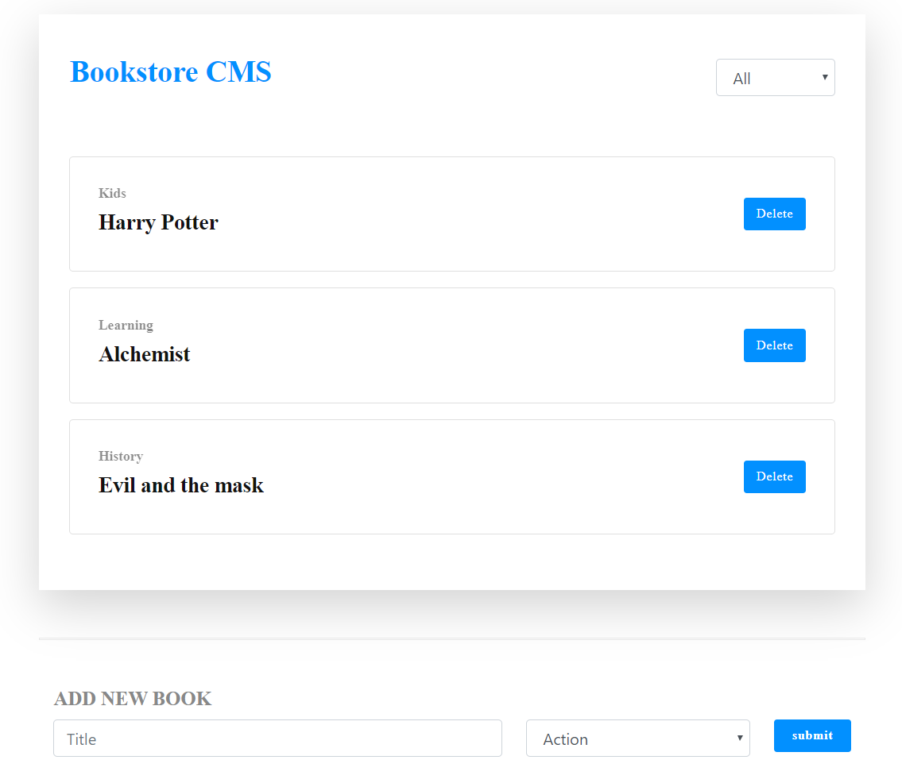

# Bookstore Project

> A very simple React-Redux application.



## Built With

- React
- Redux

## Live Demo

[Live on Heroku](https://bookstore-ad1.herokuapp.com/)

## Getting Started

This project was bootstrapped with [Create React App](https://github.com/facebook/create-react-app).

To get a local copy up and running follow these simple example steps.

## Setup

Clone this repository to your machine

```bash
git clone git@github.com:juzQrios/Bookstore.git
cd Bookstore
```

## Install

Install dependencies

```bash
npm install
```

## Start local server

In the project directory, run:

```bash
npm start
```

View the application at [`http://localhost:3000`](http://localhost:3000)

## Authors

👤 **Addo Forison**

- Github: [@Forison](https://github.com/Forison)

👤 **Darshan**

- Github: [@juzQrios](https://github.com/juzQrios)

## Reviewers

> Additional support from [Microverse](https://www.microverse.org/) team.
